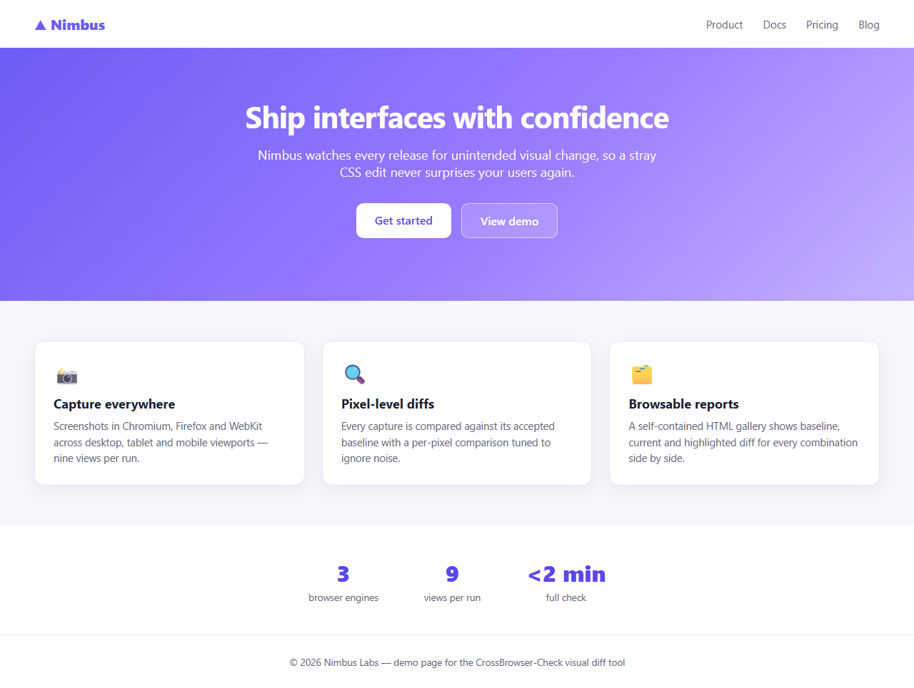
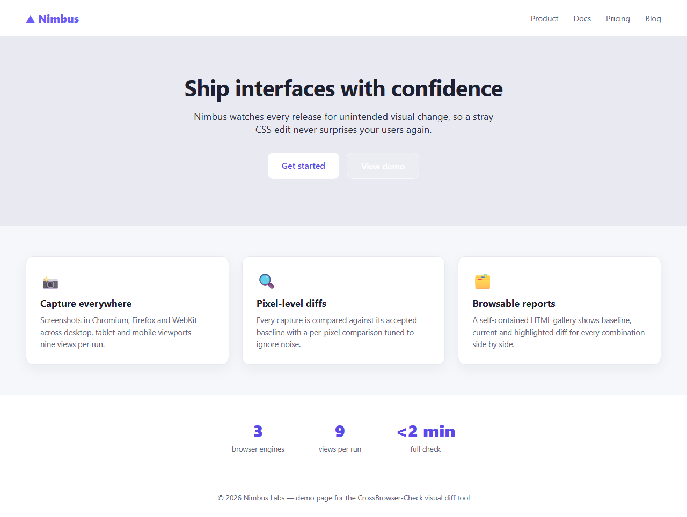
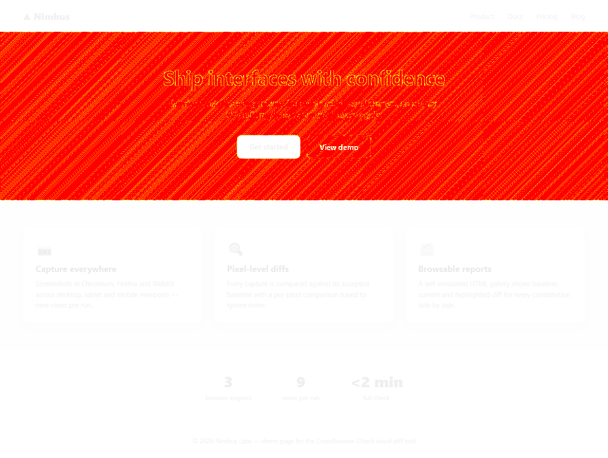
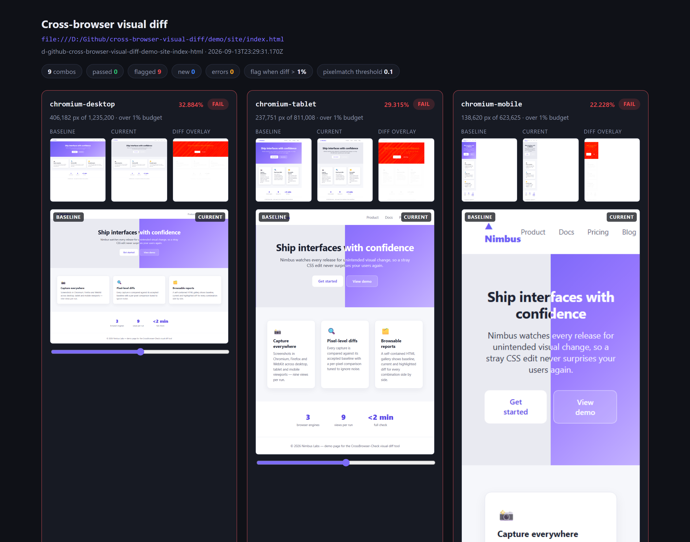

# CrossBrowser-Check

Cross-browser visual regression checking from the command line. It screenshots a URL in **Chromium, Firefox and WebKit** across **desktop, tablet and mobile** viewports, pixel-diffs every capture against an accepted baseline, and writes a self-contained HTML gallery that highlights exactly what changed — so a stray CSS edit never reaches your users unnoticed.

Built with [Playwright](https://playwright.dev) and [pixelmatch](https://github.com/mapbox/pixelmatch). A full 9-combination run finishes in well under two minutes.

## What you get

A run against the bundled demo site with one intentionally broken CSS rule (the hero lost its gradient):

| Baseline                                                                       | Current                                                                          | Diff overlay                                                                               |
| ------------------------------------------------------------------------------ | -------------------------------------------------------------------------------- | ------------------------------------------------------------------------------------------ |
|  |  |  |

The HTML report shows every browser/viewport combination side by side, with a draggable before/after slider per card:



## Install

```bash
git clone https://github.com/Yvneif/CrossBrowser-Check.git
cd CrossBrowser-Check
npm install
npx playwright install chromium firefox webkit
```

Requires Node.js 20+.

## Quickstart

```bash
# 1. Capture every combo — first run marks them all NEW
node src/index.js run https://example.com

# 2. Happy with how the page looks? Promote the captures to the baseline
node src/index.js accept

# 3. Later: re-run the same URL. Visual changes are flagged FAIL with exit code 1
node src/index.js run https://example.com
```

Open `report/index.html` after any run to browse the gallery.

### Try the demo

The repo ships a demo page (`demo/site/`) and an intentionally broken variant (`demo/site/broken.html`, one broken `.hero` rule):

```bash
node src/index.js run "file://$PWD/demo/site/index.html"   # macOS/Linux
node src/index.js accept
cp demo/site/broken.html demo/site/index.html              # introduce the "bug"
node src/index.js run "file://$PWD/demo/site/index.html"   # 9 combos FAIL, exit code 1
git checkout -- demo/site/index.html                       # restore the clean page
node src/index.js run "file://$PWD/demo/site/index.html"   # all PASS again
```

On Windows use `file:///D:/path/to/demo/site/index.html` style URLs.

## Usage

```
vdiff run <url> [options]     capture, compare against baseline, write report
vdiff accept [options]        promote the latest captures to the baseline
vdiff report                  regenerate the HTML report from the last run
vdiff help                    show all options
```

Common tasks:

```bash
# Only two browsers, only mobile — handy while tuning a breakpoint
node src/index.js run https://example.com --browsers chromium,firefox --viewports mobile

# Custom viewport size next to the presets
node src/index.js run https://example.com --viewports desktop,1440x900

# Stricter budget: flag anything over 0.2% of pixels
node src/index.js run https://example.com --max-diff-percent 0.2

# Accept only the combos you reviewed
node src/index.js accept --only chromium-desktop,firefox-mobile
```

Exit codes for `run` (CI-friendly): `0` all combos passed or are new · `1` at least one combo exceeded the diff budget · `2` at least one capture failed (launch, navigation, …).

Artifacts land relative to the working directory: `shots/` (captures + diff overlays), `baselines/` (accepted references), `report/` (`index.html` + `results.json`).

## Configuration

| Flag                         | Default                   | Meaning                                                                                               |
| ---------------------------- | ------------------------- | ----------------------------------------------------------------------------------------------------- |
| `--browsers <list>`          | `chromium,firefox,webkit` | Engines to capture.                                                                                   |
| `--viewports <list>`         | `desktop,tablet,mobile`   | Presets (desktop 1280×800, tablet 768×1024, mobile 375×667) or custom `WxH` sizes.                    |
| `--max-diff-percent <n>`     | `1`                       | Budget: combos whose differing-pixel percentage exceeds this are flagged FAIL.                        |
| `--pixelmatch-threshold <n>` | `0.1`                     | Per-pixel color sensitivity passed to pixelmatch (0–1). Higher = fewer anti-aliasing false positives. |
| `--viewport-only`            | off                       | Capture just the viewport instead of the full page.                                                   |
| `--wait <ms>`                | `500`                     | Settle delay after network idle (lets web fonts finish).                                              |
| `--timeout <ms>`             | `30000`                   | Navigation timeout.                                                                                   |
| `--open`                     | off                       | Open the report in the default browser.                                                               |
| `--only <list>`              | —                         | (`accept`) Promote only these combos.                                                                 |
| `--slug <slug>`              | last run                  | (`accept`) Operate on this URL slug.                                                                  |

## How comparison works

Each URL gets a slug (e.g. `example-com`); baselines are stored per **browser × viewport** under that slug, so Chromium is only ever compared against a Chromium baseline and a 375px capture against a 375px baseline. Differing pixels are drawn in red over a faded baseline in the diff overlay. If a capture's dimensions change (content grew or shrank), the smaller image is padded with white and the combo is marked as a size mismatch — new visible content counts as a difference.

## Known tradeoffs

- **Font rendering differs across OS/browser versions.** Same-machine runs are usually clean; comparing baselines produced on a different OS can produce noisy diffs. Tune `--pixelmatch-threshold` and `--max-diff-percent` to your tolerance — this is a deliberate tradeoff, documented rather than hidden.
- **Dynamic content (ads, timestamps, rotating images) causes false positives.** Region masking/exclusion is the planned answer (see roadmap below); until then, prefer stable pages or `--viewport-only` above the fold.
- **The baseline is per-URL.** Comparing `index.html` against `broken.html` looks like a brand-new page; the intended workflow is: the _same_ URL changes over time, and each run diffs against the last accepted state.

## Roadmap

- Ignore/mask regions (rectangles or selectors) for dynamic content
- GitHub Actions workflow example
- Parallel browser launches for even faster runs

## Development

```bash
npm test            # Vitest unit suite
npm run lint        # ESLint
npm run format      # Prettier
```

Source layout: `src/capture.js` (Playwright screenshots), `src/diff.js` (pixelmatch + size-mismatch padding), `src/baseline.js` (slug + accept logic), `src/report.js` (HTML gallery), `src/run.js` (orchestration + status rules), `src/args.js` (CLI parsing), `src/index.js` (entry point).

## License

[MIT](LICENSE)
